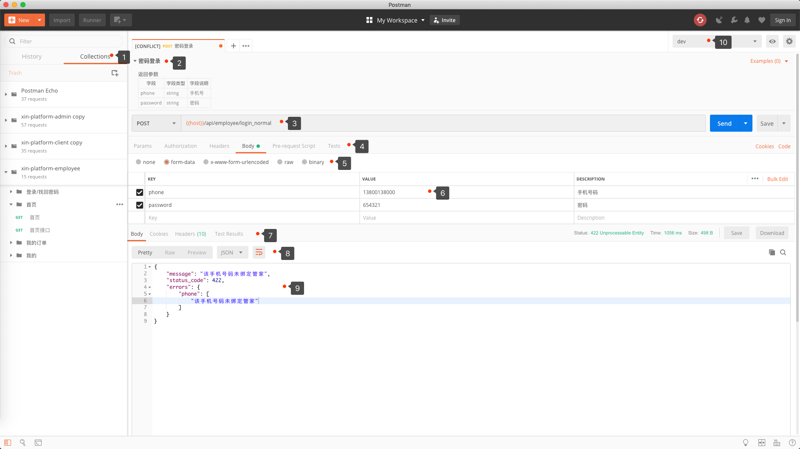

### Postman基础认识

1. Collection集合：Api归类管理、集成文档、集合测试、导出、Mock等操作

2. Api标题、以及文档描述，支持Markdown格式 

3. 请求URL，支持变量环境配置 

4. Params请求URL参数管理、Authorization鉴权管理、Header请求头设置、Pre-request Script请求开始前的脚本处理、Tests测试脚本 

5.  请求内容参数配置。分四种内容类型:

   1. **form-data**：表示http请求中的multipart/form-data方式，会将表单的数据处理为一条消息，用分割符隔开，可以上传多个文件。

      

   2. **x-www-form-urlencoded**:会将请求的内容转换为键值对。
         如：phone=13800138000&password=654321

      

   3.  **raw**:可以上传任意格式的**文本**。如：json、text、xml、html等。

   4. **binary**:文件类型上传

6. 请求内容参数配置，参数key、请求参数value、参数描述。

7. Body返回内容的查看、Cookies：服务器返回的cookie信息、Headers:请求头信息、Test Results测试结果信息

8. 不同的格式查看方式。Pretty类型是格式了XML和JSON预览方式。raw是文本方式查看。Preview是针对Html方式返回的内容进行查看。

9. 同上显示返回内容的区域，根据不同的选择，展示不同的预览格式。

10. 切换环境变量
